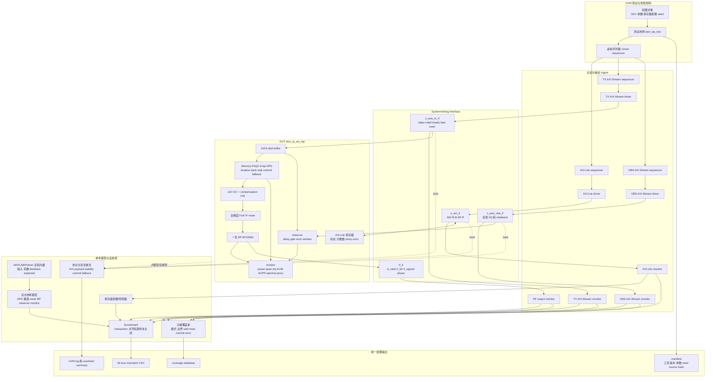

# BP EFDSM2 数字发射机 IP 验证计划

文档版本：2.7
更新时间：2026-08-16 13:00 +08:00
适用顶层：`dsm_ip_axi_top`

## 1. 验证范围

主验证 SKU 固定为：

```text
ALGORITHM          = 3
DUC_MODE           = 3
INTERP_MODE        = 4
INTERP_IMPL        = 0
ENABLE_DPD_POLY    = 0
ENABLE_DPD_LUT     = 0
ENABLE_DPD_MEMORY  = 1
DPD_MP_MAX_TAPS    = 4
DPD_POLY_ORDER     = 5
aclk               = 100 MHz
```

主链路为：

```text
AXI4-Stream Q1.15 I/Q
 -> Memory-Poly5 4-tap DPD
 -> x32 插值
 -> 全精度 Fs/4 实数 IF
 -> 一位 BP EFDSM2
 -> rf_bit/rf_signed
 -> behavioral DPA/BPF/观测接收机
 -> EVM/SNDR/ACLR
```

验证目标：

- 证明 RTL 的定点算法、时序、复位、流控和寄存器行为正确；
- 证明 MATLAB 与 RTL 在冻结的数值契约下逐样本等价；
- 证明 DPD 系数写入、双 bank 原子切换和故障回退不会破坏数据流；
- 分开签核 RTL、PS 软件、校准策略、behavioral RF 和物理板级反馈；
- 所有性能结论都标明模型、波形、接收机、工具和证据等级。

## 2. 验证边界

### 2.1 RTL DUT

UVM/XSim/VCS 的 DUT 是真实交付 RTL，不复制数据通路。主要文件包括：

- `rtl/axi/dsm_ip_axi_top.v`
- `rtl/ip/dsm_ip_top.v`
- `rtl/dpd/`
- `rtl/interp/`
- `rtl/tx_bandpass_if/`
- `rtl/axis/axis_skid_buffer.sv`

source list 必须与 Vivado/DC 主 SKU 一致。

### 2.2 软件与算法

- PS C 负责寄存器配置、DMA 重放、候选评分、排序和安全提交；
- MATLAB/Python 负责 PA/DPA 模型、指标、系数训练、量化和参考计算；
- AI 仅用于低速 seed/package 建议，最终仍经过安全仲裁和有界搜索；
- UVM 不负责证明 PS 算法、AI 策略或真实 RF 性能。

### 2.3 当前非目标

- 不把 MATLAB behavioral DPA 称为 ADS、实测 PA 或硅后结果；
- 不把数字 monitor proxy 称为物理功率、EVM 或 ACLR；
- 不声称已经接通 FMC DPA/PA、ADC 和物理反馈闭环；
- 不把历史 LPDSM2 Fs/4 合路结果用于当前 BP EFDSM2 性能结论；
- 不要求在高速数据通路中部署神经网络。

### 2.4 IP-system UVM 功能覆盖收口证据

- Linux VCS V-2023.12-SP1 已完成 19 项主 SKU 系统回归，全部为
  `UVM_ERROR=0`、`UVM_FATAL=0`：`dsm_bp_test`、performance bit-true、memory-DPD
  bit-true、memory-DPD safety、AXI protocol 三个 seed、control stress 三个 seed，以及
  memory-DPD commit stress 三个 seed、AXI-Stream sideband coverage 三个 seed、system
  closure 三个 seed。
- 统一结果位于生成物
  `uvm_verif/sim/out/vcs/ip_coverage_summary.csv`；该文件、VCS 编译产物、coverage
  database 与 waveform 均不纳入版本控制。
- 主 SKU 定义的 functional coverage 已达到 100%：AXI-Lite control、RF 输出编码、TX/OBS
  AXI-Stream sideband/stall，以及 system closure 的 `DPD mode × commit outcome × reset ×
  AXI response stall × observer window state`。system testcase 还检查 monitor/counter
  readback、sticky error、bank/epoch 拒绝保持和 W1C clear。
- 明确 exclusion：Poly/LUT DPD 为该 SKU 的编译裁剪路径；memory DPD 的 commit/reject 在
  bypass 下完成后才可进入 memory mode；commit 与 observer measurement window 串行化；reset
  期间不允许 commit outcome；干净完成窗口以 `clean_done` 表示而不重复计作 `done`；observer
  active/clean-complete 下的零周期 AXI 读响应不增加状态机语义，idle CSR 已覆盖该零等待路径。
- 并发 SVA 未出现断言失败：AXI-Lite、TX/OBS AXI-Stream stall payload 稳定；soft reset
  关闭 TX 且清空 skid/datapath 可见状态；commit 串行化、bank/ack/epoch 契约、失败 commit
  保持 active bank；observer ready 状态约束均已运行。RF 编码中不可能的
  `{rf_bit, rf_signed}` 组合被明确排除，并由断言保留其正确性约束。
- `feedback` subsystem 额外使用数据感知的异步 FIFO 顺序检查器：在异步源/目的时钟上记忆
  `{data,last,user}` 输入序列，并在目的端逐 transaction 比较。因此 FIFO 顺序验证不只依赖
  局部 ready/valid 属性。该检查器是仿真 collateral，不属于可综合 RTL。
- Linux VCS SVA/FIFO 检查仍是仿真证据；此外，2026-08-15 已使用 VC Formal
  `V-2023.12-SP2` 对固定 Performance SKU 的控制与协议边界完成独立 FPV：14/14 assertion
  proven、18/18 non-vacuous、7/7 cover covered，且模型无 black box。该证明覆盖 AXI 响应
  stall 稳定性、RF 编码、soft-reset drain、memory-DPD commit/bank/ack/epoch/failure 和
  observer ready 状态约束。
- FPV 中保持运行时 `soft_reset` 可达，并用专用 assertion/cover 检查；只排除默认假设
  “复位仅用于初始化”的通用 reset-setup 规则。其余 setup 检查均为零违规。该结果不替代
  CDC/RDC 静态分析、形式算术等价、其他 compile-time SKU 或门级/SDF 签核。
- 当前 URG 总分为 66.58%（line 59.74%、condition 57.56%、toggle 62.79%、branch
  41.99%、assert 77.42%、group 100.00%）。本轮结论是“既定功能点的 functional
  coverage closure”，不是全 RTL code coverage closure 或最终签核。
- 可复跑入口为 `uvm_verif/sim/run_ip_coverage_linux.sh`；Windows 通过
  `uvm_verif/sim/run_ip_coverage_bridge.ps1` 向 Linux/VCS bridge 提交同一命令。

## 3. 测试平台框图

### 3.1 UVM/RTL 主测试平台



该平台只验证数字 RTL。behavioral DPA 不直接放进 DUT；MATLAB/Python 先生成冻结的反馈 I/Q 向量，再由 OBS agent 重放。这样可以让同一组向量在 XSim、VCS、UVM 和 C/Python 单元测试之间复用，并避免模拟模型的不确定性破坏 RTL 回归。

### 3.2 跨层验证闭环

```mermaid
flowchart LR
  W[QAM/OFDM 波形] --> M[MATLAB fixed reference]
  M --> GV[golden vectors]
  GV --> U[UVM/XSim RTL 回归]
  U --> RO[rf_bit 与 monitor readback]
  RO --> CMP[MATLAB/Python 逐样本比较]

  W --> PA[behavioral DPA/BPF/receiver]
  PA --> FB[冻结 feedback I/Q]
  FB --> U

  U --> PS[PS C cost 排序和 bank commit 单元测试]
  PS --> POL[AI seed + 14-candidate bounded search]
  POL --> PKG[安全系数 package]
  PKG --> U

  U --> FPGA[ZU15EG implementation 与板级 smoke]
  FPGA -. 未来物理反馈 .-> PHY[DPA/PA + coupler + receiver/ADC]
  PHY -. Q1.15 OBS AXI-Stream .-> U
```

实线表示当前可进行的数字/behavioral 验证；虚线表示尚未签核的物理反馈路径。

### 3.3 组件与目录映射

| 平台组件 | 当前路径 | 后续建设内容 |
|---|---|---|
| UVM 顶层 | `uvm_verif/tb/dsm_uvm_tb.sv` | 实例化真实 DUT、三类 interface、时钟和复位 |
| AXI-Lite interface | `uvm_verif/agent/interfaces/dsm_axi_lite_if.sv` | 增加协议断言和独立 AW/W 时序 |
| TX/OBS interface | `uvm_verif/agent/interfaces/dsm_axis_if.sv` | 分离 TX/OBS 配置，覆盖 backpressure 和 sideband |
| RF interface | `uvm_verif/agent/interfaces/dsm_rf_if.sv` | 采集 valid/bit/signed/phase |
| 冻结配置与寄存器表 | `uvm_verif/env/dsm_uvm_config.svh`、`dsm_uvm_reg_map.svh` | 主 SKU、byte address、DPD latency 和弹性流水约束 |
| transaction | `uvm_verif/agent/<protocol>/` | AXI-Lite、复数 AXIS 和 RF 输出事务，按协议归属 |
| agent/monitor | `uvm_verif/agent/axi_lite/`、`axis/`、`rf/` | 三类 agent；AXI-Lite/TX/OBS 为主动实例，RF 为被动实例；协议 monitor 已建立 |
| environment/scoreboard | `uvm_verif/env/dsm_uvm_env.svh`、`dsm_uvm_scoreboard.svh` | virtual sequencer 连接和当前 RF smoke 检查 |
| sequence/test | `uvm_verif/agent/*/*sequences.svh`、`uvm_verif/env/dsm_virtual_sequences.svh`、`uvm_verif/tests/` | 协议 sequence、跨 agent 编排和 testcase 分层 |
| 协议断言 | `uvm_verif/formal/dsm_axi_protocol_sva.sv` | 增加 reset、commit、fallback 和 observer 属性 |
| test/filelist | `uvm_verif/tests/`、`uvm_verif/sim/` | 建立 base test、功能 test、负向 test 和 regression list |
| golden vectors | `matlab/out/`、`verif/vectors/` | 冻结格式、延迟、manifest 和 expected output |
| directed baseline | `verif/tb/`、`verif/scripts/` | 在 UVM 完成前继续作为单元级 source of truth |

### 3.4 平台建设顺序

1. 冻结主 SKU、寄存器表、定点格式、延迟和 source list；已完成第一版；
2. 完成 interface 与 transaction，并加入 AXI payload-stability 断言；已完成第一版；
3. 完成 AXI-Lite、AXI-Stream 和 RF 三类 agent；TX/OBS 复用 AXI-Stream 类型形成四个实例；driver 与基础 monitor 已拆分；
4. 建立 virtual sequencer 和 virtual sequence，统一控制寄存器、TX 激励、反馈重放和 reset/stall；基础分层已完成；
5. 接入 MATLAB/Python golden vector loader 和定点 reference model；
6. 完成 scoreboard 的 transaction 对齐、逐样本比较和 monitor readback 比较；
7. 加入 commit/fallback/reset/backpressure 的 SVA 与负向测试；随机 AXI 时序与基础 SVA 已完成，commit/fallback/reset 仍待补齐；
8. 建立 functional coverage、cross coverage 和 regression manifest；
9. 最后接 PS C 等价测试、behavioral DPA held-out 测试和 ZU15EG 板级 smoke。

## 4. 分层签核

| 签核门 | 负责范围 | 主要方法 | 当前状态 |
|---|---|---|---|
| `RTL-UNIT` | DSM、DPD、插值、observer、monitor 算术 | XSim/VCS、逐样本参考 | 部分已有定向回归 |
| `RTL-PROTOCOL` | AXI-Lite、AXI-Stream、复位、backpressure、错误路径 | UVM、断言、scoreboard、覆盖率 | XSim 基础 smoke 与随机协议测试已通过；负向矩阵和覆盖率未签核 |
| `BITTRUE` | MATLAB 与 RTL 定点等价 | MATLAB + XSim/VCS | 多个单元已闭环，主 BP 全链仍需统一审计 |
| `PS-SW` | DMA、寄存器顺序、cost、排序、commit/fallback | C 单元测试、Python/C 等价 | 框架已实现，未作为 UVM 范围 |
| `POLICY` | known/unknown/OOD、seed、安全搜索 | Python/C 决策日志 | 有离线证据，不是高速 AI RTL |
| `RF-BHV` | behavioral DPA 下 DPD 效果 | MATLAB/Python held-out 比较 | 有阶段性结果，依赖冻结模型 |
| `FPGA` | ZU15EG 资源、时序、bitstream、DMA/ILA | Vivado/Vitis/板卡 | 历史 Cartesian 基线闭环；当前 BP SKU 未完整闭环 |
| `ASIC-PRE` | 28 nm 预布局面积、时序、功耗 | DC | 主 BP SKU 有 pre-layout 结果 |
| `RF-PHYSICAL` | DPA/PA、BPF、耦合器、接收机、ADC | ADS/实验室仪器 | 未签核 |

任一层通过都不能替代其他层。

## 5. RTL 测试矩阵

### 5.1 BP EFDSM2 与 IF

| ID | 场景 | 通过条件 |
|---|---|---|
| `BP-001` | 复位、零输入、重新使能 | 无 X/Z，状态和 valid 可预测 |
| `BP-002` | 正负小幅常值及交替输入 | 符号、相位和状态更新与参考一致 |
| `BP-003` | Q1.15 最大值、最小值和边界值 | 无错误扩展、截断或非预期 wrap |
| `BP-004` | I-only、Q-only、复数 tone | Fs/4 mixer 相位顺序和 valid 对齐正确 |
| `BP-005` | QPSK/16QAM/64QAM OFDM | transaction 不丢失、不重复、不重排 |
| `BP-006` | 长时间随机满幅输入 | 状态有界，无非预期溢出 |
| `BP-007` | active stream 中复位 | 输出、状态和计数器按契约恢复 |

### 5.2 AXI-Lite 与 AXI4-Stream

| ID | 场景 | 通过条件 |
|---|---|---|
| `AXI-001` | 连续 valid/ready | 每次握手只接收一次 |
| `AXI-002` | 25/50/75% 随机 stall | stall 时 payload/sideband 稳定 |
| `AXI-003` | valid gap、单拍和多帧 | frame、sample、tlast 计数正确 |
| `AXI-004` | tuser 错误注入 | sticky error 和计数器正确 |
| `AXI-005` | AW/W 不同到达顺序 | 写请求只执行一次 |
| `AXI-006` | BREADY/RREADY 长延迟 | response 保持到握手完成 |
| `AXI-007` | 软复位、关停和 drain | 不产生半 transaction 或幽灵输出 |
| `AXI-008` | 长 backpressure 后恢复 | 无丢样、重复和死锁 |

当前自动化用例 `dsm_axi_protocol_test` 已覆盖 AXI-Lite 独立 `AW/W` 延迟、
`BREADY/RREADY` 延迟、TX/OBS AXI-Stream 随机 valid gap、observer 基础启动和
主链 drain。XSim seed 7 对 64 个输入得到 2048 个 RF transaction，observer
配对 64、丢弃 0、窗口正常完成，零 UVM error/fatal 且上述协议 SVA 无失败。
25/50/75% 长 stall、active-stream
reset、`tuser` 注错和覆盖率 closure 仍为待验证项。

### 5.3 DPD 与安全机制

| ID | 场景 | 通过条件 |
|---|---|---|
| `DPD-001` | bypass 与 identity C1 | 数值一致且延迟对齐 |
| `DPD-002` | Poly3/5/7 | 各自与对应 MATLAB fixed reference 零失配 |
| `DPD-003` | Memory-poly 1/2/4/6 tap | tap 顺序、矩阵和输出零失配 |
| `DPD-004` | LUT 地址边界和 bank | 地址、符号和 bank 选择正确 |
| `DPD-005` | 合法 shadow bank commit | 只在安全边界原子切换 |
| `DPD-006` | 超限系数和非法 commit | active bank 不变，错误置位 |
| `DPD-007` | saturation fault | 回退 bypass 或已知安全 bank |
| `DPD-008` | disabled feature mode | effective mode 可预测地回退 |
| `DPD-009` | reset/stall 与 commit 交叉 | 不丢样，不发生半更新 |

### 5.4 Observer、异步反馈与 monitor

| ID | 场景 | 通过条件 |
|---|---|---|
| `OBS-001` | identity gain、delay=0 | 配对和误差逐样本正确 |
| `OBS-002` | 非零 delay、复增益 | 延迟、旋转和缩放正确 |
| `OBS-003` | feedback 早到、丢样和 overflow | drop/overflow/window invalid 正确 |
| `OBS-004` | 异步输入时钟 | FIFO 不重排；满时按配置 backpressure 或计数丢样 |
| `OBS-005` | 窗口中复位/清零 | drain 和完成状态无歧义 |
| `MON-001` | 已知 I/Q 与 rf_bit 窗口 | `MON_*` 与冻结参考逐项一致 |
| `MON-002` | AXI-Lite 读取全部 monitor | 偏移、宽度、清零和锁存正确 |
| `MON-003` | peak/clip/saturation/slew 边界 | 计数和 sticky 标志正确 |
| `MON-004` | spectral proxy 已知 tone | Goertzel/频点 proxy 与参考容差一致 |

`MON_INPUT_POWER` 和 `MON_OUTPUT_POWER` 是 RTL 累加量，只用于数值验证、诊断和安全。在一位归一化 RF 输出上，`MON_OUTPUT_POWER` 对候选 DPD 的区分能力有限。当前 PS `calibration_cost()` 主要使用 EVM/ACPR/spectral proxy 和错误惩罚，不把这两个功率寄存器作为主要优化目标。

## 6. PS 软件和校准策略验证

### 6.1 PS C

| ID | 验证内容 | 通过条件 |
|---|---|---|
| `PS-001` | VERSION/CAPABILITY/build identity | 与硬件 manifest 一致 |
| `PS-002` | 系数写入顺序与 bank commit | C 与寄存器协议一致 |
| `PS-003` | DMA 重放与计数器 | 输入、前端、DPD、输出计数一致 |
| `PS-004` | cost 定点计算 | C 与 Python bit-exact |
| `PS-005` | 14-candidate 排序 | 候选数量、顺序和最优选择一致 |
| `PS-006` | 错误惩罚和 fallback | 危险候选不能成为 active |

### 6.2 AI/优化策略

| ID | 验证内容 | 通过条件 |
|---|---|---|
| `AI-001` | 已知 condition 的 seed | Python、C 和 RTL metadata 一致 |
| `AI-002` | unknown/OOD condition | 强制 fallback 和局部搜索 |
| `AI-003` | clip/saturation/stall/error | 安全 gate 优先于评分 |
| `AI-004` | LOSO 与 blind profile | blind 数据不参与训练和阈值选择 |
| `AI-005` | seed 与 cold-start 搜索比较 | 报告候选数、成本和安全违规 |
| `AI-006` | 最终重放 | 指标不退化且安全计数为零 |

这里的 AI 是低速校准辅助，不是神经网络直接处理 100 MHz 数据流。当前 release policy 必须保留有界搜索，不能让单个预测候选绕过安全机制。

## 7. behavioral DPA 与指标验证

每个 profile 必须冻结：

- 输入调制、采样率、带宽、幅度和 seed；
- AM/AM、AM/PM、memory taps、频响、噪声、温漂和 clipping；
- 输出 BPF、观测接收机、增益/相位/延迟估计；
- train/validation/test 分割；
- EVM、SNDR、ACLR 的窗口和归一化定义。

至少比较：

1. no-DPD；
2. memoryless Poly5；
3. Memory-Poly5 4-tap；
4. seed-assisted bounded search。

通过条件不是固定的“必须提升若干 dB”，而是：同一 held-out 条件下可重复、无安全违规、报告均值与最差值，并清楚区分改善、不显著和退化。

## 8. 实现与 PPA 验证

### 8.1 FPGA

- DPD OOC：bypass、Poly3/5/7、LUT、Memory-poly 1/2/4/6 tap；
- 主 BP SKU：综合、布局布线、WNS/TNS、资源、功耗估计、bitstream；
- 所有报告注明器件、speed grade、Vivado 版本、参数和 source hash；
- OOC 通过不能代替全 TX routed 通过。

### 8.2 ASIC 预布局

- analyze/elaborate/link 无 Error/Fatal；
- 审计 signedness、宽度、未连接、常量和未加载警告；
- 报告面积、cell 数、关键路径、setup/hold、动态和漏电功耗；
- 结果只称为 pre-layout，不称为物理签核。

## 9. 板级与物理反馈计划

当前板级设计没有真实 feedback receiver。未来链路为：

```text
rf_bit -> 外部 DPA/PA -> BPF/耦合器
       -> 下变频/ADC -> Q1.15 feedback AXI4-Stream
       -> async FIFO/clock converter -> s_axis_obs
       -> observer/monitor -> AXI-Lite -> PS 校准
```

只有在原理图、时钟计划、ADC 格式、CDC、ILA capture 和 before/after 实测指标全部存在后，才能签核 `RF-PHYSICAL`。当前该层状态为 `NOT_IMPLEMENTED`。

## 10. 覆盖率与发布门槛

UVM 签核至少要求：

- 主 SKU 声明的 functional coverpoint 和 cross 全部命中，或有逐项 exclusion；
- AXI、reset、commit、fallback、observer、monitor 的 assertion 零失败；
- scoreboard 零 mismatch；
- 长 backpressure、复位中断和负向测试全部执行；
- 记录 simulator、seed、命令、source hash 和 coverage database。

项目发布必须同时给出：

- MATLAB/RTL bit-true 结果；
- RTL protocol/safety 回归结果；
- PS C/Python 等价结果；
- behavioral DPA held-out 指标；
- FPGA/ASIC 实现证据及其边界；
- 未完成项和禁止声明。

## 11. 当前结论

- RTL、MATLAB、PS 软件和离线策略已经形成较完整的工程框架；
- directed regression、DPD OOC 和 28 nm pre-layout 有可追溯证据；
- Linux VCS 已完成固定主 SKU 的 20 项 system-UVM 回归，并使用 transaction 数、scoreboard 与正常结束标记防止假通过；完整 code-coverage closure 仍未完成；
- 当前 BP EFDSM2 主 SKU已完成 ZU15EG routed OOC；仍缺 board bitstream、I/O/hold 和板级闭环；
- behavioral DPA 结果可用于算法研究，但没有真实 PA/ADC 反馈，不能宣称实测 RF 改善。

## 12. Block、Subsystem 与 System 参考模型分层

### 12.1 参考模型职责

- MATLAB fixed model 是算法、定点格式和最终数值定义的 signoff reference；
- Python integer model 是 Linux/VCS 日常回归 reference，必须使用显式整数位宽、两补码、算术右移、截断、饱和/回绕、状态更新和 valid/latency 顺序；
- SystemVerilog predictor 用于协议、寄存器、事务顺序和简单延迟预测，不复制复杂 DSP 算法作为唯一 golden model；
- Python 与 MATLAB 必须逐样本等价，Python 与 RTL 必须在有效 transaction 上零失配。

Python integer model 与 fixed-point model 不是两套算法。前者是 fixed-point 行为的一种可执行实现：Python 自身整数无限宽，因此模型必须主动施加 RTL 的每一级位宽和量化规则。

### 12.2 验证层次

```text
Block:
  DPD | interpolation | Fs/4 mixer | BP EFDSM2 | observer | monitor
  -> lightweight SV testbench + MATLAB/Python bit-true vectors

Subsystem:
  TX frontend : DPD -> interpolation
  IF/DSM      : Fs/4 mixer -> BP EFDSM2
  feedback    : observer -> monitor
  control     : AXI-Lite -> bank commit/error/status
  -> width/latency/flow-control/reset boundary checks

IP System:
  AXI-Stream I/Q -> DPD -> interpolation -> mixer -> BP EFDSM2 -> rf_bit
  -> uvm_verif agents + full-chain Python reference + scoreboard
```

目录契约：

- `verif/block/`：单模块定向验证说明与轻量 testbench；
- `verif/subsystem/`：子系统边界验证；
- `verif/vectors/`：冻结向量格式与来源；
- `uvm_verif/refmodel/python/`：无 MATLAB 依赖的 Linux/VCS bit-exact reference；
- `uvm_verif/`：完整 IP system UVM，不在 `verif/` 内重复搭建另一套 system 环境。

### 12.3 当前证据

2026-08-09 已完成第一条分层闭环：

- Python Fs/4 mixer + BP EFDSM2 integer model；
- MATLAB/Python 2048 sample comparison：registered trace 0 mismatch，core trace 0 mismatch；
- Python-to-RTL XSim subsystem comparison：2048 个 `if_sample`、`rf_bit` 和 `rf_signed` transaction 0 mismatch；
- `registered_bit` 对应历史 MATLAB 输出寄存器观察口径，`core_bit` 对应 `rf_valid` 下 UVM/RF monitor 的 transaction 口径，两者延迟差一拍且已显式记录。

下一步按相同门槛依次接入 interpolation、DPD，最后替换当前只检查数量/编码/toggle 的 UVM system scoreboard。

### 12.4 插值、DPD 与 system scoreboard 进度

2026-08-10 已按两级门槛补齐 interpolation 和 DPD 的 Python integer reference：

```text
MATLAB fixed vectors
  -> Python integer model
  -> RTL/XSim transaction dump
  -> UVM system scoreboard
```

当前已完成并实际执行的检查：

- interpolation mode 0/1/2/3/4：MATLAB/Python 128/512/1024/2048/4096 transaction 零失配；
- interpolation mode 0/1/2/3/4：Python/RTL XSim 零失配；
- Memory-Poly C1/C3/C5、4-tap：MATLAB/Python 256 samples 零失配；
- Memory-Poly C1/C3/C5、4-tap：Python/RTL XSim 256 samples 零失配。

已新增 `dsm_performance_bittrue_test`，以 Python 生成的冻结 24-sample system vector
替换只检查 RF 数量/编码的 smoke scoreboard，逐 transaction 检查 TX I/Q/`tlast` 与
768 个 RF bit、signed code、Fs/4 phase。该测试尚待 Linux VCS 编译执行，因此当前只能
称为“system scoreboard 已实现”，不能称为 VCS signoff。

该 system vector 当前选择 runtime DPD bypass，以隔离并签核主 TX 流
`AXI-Stream -> interpolation -> mixer -> BP EFDSM2`。Performance SKU 的
Memory-Poly5/4-tap DPD 已分别完成 block 级数值闭环；后续需要增加 AXI-Lite 写
coefficient bank、atomic commit、runtime memory mode 和 fallback 的 UVM system testcase。

### 12.5 Memory-DPD system testcase

2026-08-10 已实现 `dsm_memory_dpd_bittrue_test` 和 `dsm_memory_dpd_safety_test`：

```text
Python coefficient package / RF reference
  -> AXI-Lite writes inactive MP bank
  -> MP_COMMIT request and ack polling
  -> runtime memory mode and effective-status check
  -> AXI-Stream input replay
  -> DPD -> interpolation -> mixer -> BP EFDSM2
  -> per-transaction RF scoreboard
```

有效 package 使用 4 tap x C1/C3/C5 的 12 个 Q2.14 complex coefficients；UVM 从 Python
生成的 CSV 读取同一 package，避免在 MATLAB/Python/UVM 之间手工复制系数。负向 testcase
写入绝对值 24577 的非法系数，并要求 commit failed、`ERROR.bit3` 置位、active bank 不变。

2026-08-12 已在当前 RTL revision 上重新执行 Linux VCS：
`dsm_memory_dpd_bittrue_test` 完成 768 个 RF transaction 的 Python golden 逐项比较，
`dsm_memory_dpd_safety_test` 完成非法系数拒绝路径；两个 testcase 均为
`UVM_ERROR=0`、`UVM_FATAL=0`。此前的 two-slot Fs/4 phase debug offset 已在 mixer/BP
边界修复并由该次 full-chain testcase 重新确认。因此 AXI control plane 与 active
Memory-Poly5/4-tap datapath 已具备 system-level UVM 证据。

### 12.6 2026-08-12 Block 验证阶段结论

本轮 block signoff 已由 `verif/scripts/run_block_signoff.ps1 -BpSamples 4096`
实际执行并以 exit code 0 结束。覆盖范围为：

- DPD Poly3/5/7、Memory-Poly 的 MATLAB/RTL 逐样本比较，三个结果均为 256/256、零失配；
- 插值 mode 0 至 4、x32 的 I0/I1/I2/I3 输出各 4096 样本零失配，并覆盖 97 输入样本和
  1084 次输出 backpressure；
- Fs/4 mixer 的 8 组定向角点及 257 组随机样本；
- BP EFDSM2 的 4096 组带固定种子的随机/极值/enable bubble 向量；
- 双时钟 observer bridge 的 24 组定向样本和 129 组随机样本、225 次输出停顿；
- monitor 的 MATLAB behavioral 计数向量，以及 129 样本、12 个 invalid beat 和 clear 路径。

因此当前 fixed RTL revision 的 block 验证可以收口，并进入或继续扩展 subsystem 和
IP-system 验证。该结论不包含 formal CDC/RDC、完整 lint、门级/SDF、物理实现或真实
PA/ADC/RF feedback 签核。

### 12.7 Subsystem 功能验证状态

- IF/DSM：`Fs/4 mixer -> BP EFDSM2` 已完成 4096 transaction 的 Python-to-RTL 零失配。
- TX frontend：`DPD bypass -> x4 interpolation` 已完成 97 输入、388 输出的逐样本零失配，
  并覆盖 140 个 output backpressure 周期。
- Feedback：`async bridge -> observer` 已完成 129 feedback beat 联合测试，117 有效配对、
  12 invalid drop、191 源端停顿、零 FIFO drop 和零 `error_acc`。
- Control：`dsm_ip_axi_top` 上下文中的 XSim control-in-context smoke 已通过，覆盖 AW-first/
  W-first、WSTRB、B/R response backpressure、soft reset、register readback、LUT/Memory
  coefficient bank commit、非法 package reject、sticky-error clear、observer/monitor status。
  该 TB 位于 `verif/subsystem/control/tb/`，通过 `run_xsim_control_subsystem.ps1` 执行。
- Control 的完整交叉接口验证仍由 Linux/VCS UVM 承担；当前 memory-DPD bit-true 与 safety
  testcase 均已通过。该层不是用 XSim smoke 替代 UVM，而是为 UVM 的多 seed coverage、
  active-stream reset、长时 backpressure 和 `tuser` 错误注入提供稳定的 directed 基线。
- Control reset recovery：`tb_dsm_ip_axi_active_reset.sv` 在第 4 个 AXI-Stream input
  transaction 后请求 `CTRL.soft_reset`。它断言复位窗口内 `TREADY=0`，并检查复位后
  16 个输入 transaction 全部恢复、软件复位计数增加一次、不会产生误报 sticky error，且可
  再次观察到 RF 输出。
- 2026-08-12 的 XSim 基线显示四个子系统均通过，但 XSim 仅是 Windows 本地 smoke 证据。
  当前正式 subsystem signoff 统一迁移到 Linux VCS bridge：TX frontend、IF/DSM、feedback
  运行 focused SV testbench；control 运行已有 UVM AXI 多接口回归。
- 2026-08-13 已通过 `run_subsystem_vcs_linux.sh` 生成统一 `subsystem_summary.csv`。bridge
  返回 `last_exit=0` 且日志包含 `SUBSYSTEM_VCS_SIGNOFF_PASS`；TX frontend、IF/DSM、feedback
  和 control 均为 `PASS`。其中前三项使用 focused VCS SV testbench，control 使用 8 项
  Linux VCS UVM 回归，所有运行均为 `UVM_ERROR=0`、`UVM_FATAL=0`。当前 RTL revision 的
  subsystem functional signoff 已收口。

### 12.8 IP-System UVM 收口状态

subsystem 收口后的系统级任务已经落地：

1. AXI-Lite 已覆盖 AW/W 独立到达、B/R backpressure、随机寄存器访问和多 seed 压力；
2. TX/OBS AXI-Stream 已覆盖 valid gap、backpressure、`tlast/tuser` 场景及 active-stream
   soft reset；
3. performance、memory-DPD bit-true/safety/commit stress、AXI sideband 和 system closure
   已纳入 19 项 Linux VCS 回归，定义的 functional coverage 为 100%；
4. Python full-chain golden scoreboard 对 `rf_bit`、`rf_signed` 和 Fs/4 phase 做逐 transaction
   比较，UVM predictor 不替代复杂 DSP 的 Python/MATLAB reference。

当前结论是固定主 SKU 的 IP-system 功能验证和已定义功能覆盖已收口。URG code coverage
总分 65.87% 不是全代码覆盖签核，后续若以 ASIC signoff 为目标，仍需针对不可达代码做分析、
合理 exclusion，并补 lint、CDC/RDC 和门级/SDF。

### 12.9 VC Formal FPV 状态

2026-08-15 使用 VC Formal `V-2023.12-SP2` 对真实 `dsm_ip_axi_top` 的固定 Performance SKU
执行 FPV。配置为 BP EFDSM2、Fs/4 IF、x32 CIC/compensation-FIR 插值、Poly5、Memory-Poly5 4-tap，LUT DPD
关闭；模型无 black box。

- 14/14 assertion proven；
- 18/18 vacuity check non-vacuous；
- 7/7 cover reachable；
- clock、glitch、组合/振荡环和 multi-driver setup 检查零违规。

`core_rst_n` 包含可运行时触发的 `soft_reset`，因此不适用“复位只在初始化出现”的通用
reset-setup 规则。该类别被显式排除，但 `soft_reset` 没有被约束为常零；TX closure、datapath
drain、commit cancellation 和 reachability 仍在 FPV 中证明。FPV 发现并促成修复 sticky
commit rejection 误关联新事务，以及 soft reset/commit completion 同拍导致 epoch 错增两个
RTL 缺陷。修复后 memory-DPD bit-true 与 safety UVM 用例均复跑通过。

该结论仅覆盖上述固定配置的控制/协议性质，不等同于 CDC/RDC、DPD 算术形式等价、所有 SKU、
门级/SDF 或物理实现签核。

### 12.10 System UVM 负向场景与分层回归计划

主 SKU 不做所有 DSM、插值和 DPD 选项的全笛卡尔积穷举。固定主链路
`Memory-Poly5 4-tap -> interpolation x32 -> Fs/4 -> BP EFDSM2` 承担完整
system-UVM、formal 和后续实现签核；其他 DSM、插值和 DPD 配置分别保持 block bit-true
和 wrapper smoke 证据，并仅对高风险交叉组合追加定向测试。

新增 `dsm_negative_control_test` 覆盖合法软件请求但硬件必须安全处理的情景：

- 对未综合的 Poly/LUT DPD 请求，读回请求模式、bypass 有效模式和 `fallback` 状态；
- TX `TUSER` 置位 `ERROR.bit1` 后，验证写零不会清除 W1C sticky error；
- 对同一 bit 写一后，验证该 sticky error 正确清除。

日常 `run_ip_coverage_linux.sh` 是 20-run 快速收口。另提供
`run_ip_extended_regression_linux.sh`：六个协议/控制/system testcase 乘 20 个 seed，
共 120 次 VCS 运行，用于夜间随机压力回归。仍未覆盖的 bin 应先区分不可达、配置裁剪和
真实漏测，再通过 constraint 或专用 sequence 补齐，而不是为追求百分比违反接口契约。

### 12.11 Regression PASS 门控

回归不能只看 shell exit code。`run_regression.py` 对每个 testcase 同时要求：

1. simulator return code 为 `0`；
2. 最终 UVM summary 中 `UVM_ERROR=0` 且 `UVM_FATAL=0`；
3. log 含 `[TEST_DONE]`，确认 run phase 正常结束；
4. log 含 `[BP_SCORE] rf=<N>` 且 `N>0`，确认真实 scoreboard 已执行并至少观察到一个 RF
   transaction。

任一项缺失，该条回归在 CSV 中标为 `FAIL`。性能 SKU 的 bit-true testcase 还由
scoreboard 强制检查 vector 可打开、RF transaction 数等于预期、队列完全 drain、`rf_bit`
与 `rf_signed` 对齐；因此不能因零 transaction、过早结束或关闭 scoreboard 而误报通过。

### 12.12 单 Lane 提速与并行化探索

当前主 SKU 的单 lane 输出为 `Fs=100 MS/s`，采用 Fs/4 混频时中心 IF 为 `25 MHz`。
后续提速先不修改已收口的功能实现，而是用完整主链路
`Memory-Poly5 4-tap -> interpolation x32 -> Fs/4 mixer -> BP EFDSM2` 在 ZU15EG 上进行
单 lane OOC 扫频。扫频点为 `150/175/200/225/250 MHz`，脚本为
`syn/run_ooc_bp_ef2_lane_sweep.ps1`；每个点独立记录资源、WNS 与估算 Fmax。

2026-08-16 完成完整 Performance SKU 的 ZU15EG `100 MHz` routed OOC：setup `WNS=+2.632 ns`、
`TNS=0`、0 failing endpoints，估算 `Fmax=135.72 MHz`。此前 `WNS=+3.478 ns`、
`Fmax=153.33 MHz` 仅为 pre-route OOC 结果；当前以 routed 结果为准。当前实现不应宣称
满足 `200 MHz` 或 `312.5 MHz`；后两者保留为独立 RTL 优化或架构实验，不计入主 SKU。

当前交付冻结为 `100 MHz` 单 lane，对应 `Fs=100 MS/s`、Fs/4 中心 IF `25 MHz`。routed OOC
使用 `12,964` LUT、`15,316` FF、`266` DSP48、`0` BRAM/URAM；功耗估计为 `1.099 W` total
(`0.389 W` dynamic)，因未回标真实活动，不能视为板级功耗。下一步是恢复本地 ZU15EG 工程后
完成 bitstream、I/O/hold 和板级数字数据流复现，再考虑提速。

该次实现仍包含 DSP `MREG/PREG` 流水建议，属于 PPA 改进项而不是功能或 100 MHz setup 失败。
DC lint 的本轮复跑被 `DCSH-1` 许可证限制阻断，CDC/RDC、gate/SDF 与完整 code coverage
closure 也不在当前 routed-OOC 结论内。

`dsm_core_ef2` 的误差反馈计算包含 `e1/e2 -> coefficient multiply -> sum -> quantize -> e0`
并在下一时钟沿写回状态。普通数据通路可通过增加寄存器级数提高 Fmax；该反馈环不能任意
插入寄存器，否则改变状态更新顺序与 NTF。若单 lane 不能满足目标，后续应研究状态预测、
loop unrolling 或并行 DSM 架构，并先用 Python/MATLAB 建立逐 bit 等价参考。

并行探索从独立的 `parallel_dsm` 实验开始，不修改 Performance SKU。若一个 lane 为
`200 MHz`，逻辑等效采样率为 `L * 200 MS/s`，且 Fs/4 中心频率为其四分之一；例如四 lane
内部并行输出为 `800 MS/s` 等效采样、`200 MHz` IF。该结论仅表示数字并行吞吐，不表示
FPGA 引脚可直接输出同速串行 RF。物理高速输出仍需要确定的时钟、lane deskew、SERDES/外部
MUX、driver、DPA 与匹配网络。

### 12.13 代码覆盖率收口计划

固定 Performance SKU 的功能 coverage 已达到 `100%`，但这不等同于 RTL code coverage
签核。最近保留的 code-coverage 基线总分为 `66.58%`；其 line、condition、toggle、branch
和 assertion 细项必须以重新生成的 URG 报告为准，不能用旧数据库推断新结果。

收口目标是冻结主 SKU 的所有**可达**代码达到 `100%`，并形成可审计的 exclusion 清单：

1. 恢复 VCS 编译许可证和 URG coverage 许可证，生成统一 `line/condition/toggle/branch/assert`
   报告；
2. 将未覆盖项分类为可达、compile-time 裁剪或协议不可达；
3. 对可达项补定向场景，优先覆盖 reset/commit/window/overflow/fallback、AXI W1C、response
   stall、TX/OBS long backpressure、`tlast/tuser` 错误注入和 observer FIFO 边界；
4. 对 feature gate 关闭的 Poly/LUT 分支、禁止在 active stream 中切 bank 等项记录理由、相关
   parameter 和审计位置，不为了覆盖率违反接口契约；
5. 先运行 20 项快速回归，再执行 20 seed x 6 testcase 的 120-run 扩展回归，并保存 source hash、
   command、coverage database 和汇总报告。

2026-08-16 的 120-run 尝试在 VCS 编译阶段因 license server 不可连接而退出 `255`，未执行任何
testcase。另一次 URG 报告生成因缺少 `VCSTools_Net` 或 `VT_CoverageURG` 许可证失败。两者均为
环境阻塞，不构成 RTL pass/fail 结论；许可证恢复前，项目只能宣称“功能 coverage 收口”，不能
宣称“code coverage 签核”。
